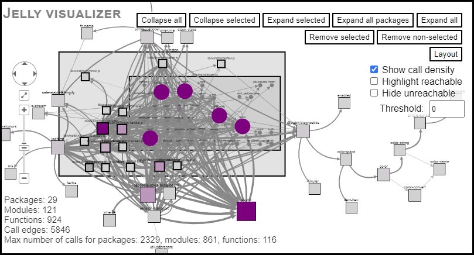

# Jelly

[](LICENSE)
[](https://www.npmjs.com/package/@cs-au-dk/jelly)

#### Copyright © 2023-2025 Anders Møller & Oskar Haarklou Veileborg

Jelly is a static analyzer for performing

* *call graphs construction*,
* *library usage pattern matching*, and
* *vulnerability exposure analysis*

for JavaScript (and TypeScript) programs that use the Node.js platform.

The analyzer design is based on ideas from JAM [1], TAPIR [2] and ACG [3] with support for approximate interpretation [4]
and indirection-bounding [5].
Its core is a flow-insensitive control-flow and points-to analysis, together with access paths for tracking library usage.
It models the main parts of the ECMAScript language and standard library (intentionally not fully soundly!),
and (for now) treats the Node.js standard library as unknown code.

[1] Benjamin Barslev Nielsen, Martin Toldam Torp, Anders Møller:
[Modular call graph construction for security scanning of Node.js applications](https://dl.acm.org/doi/10.1145/3460319.3464836).
Proc. ISSTA 2021: 29-41

[2] Anders Møller, Benjamin Barslev Nielsen, Martin Toldam Torp:
[Detecting locations in JavaScript programs affected by breaking library changes](https://dl.acm.org/doi/10.1145/3428255).
Proc. ACM Program. Lang. 4(OOPSLA): 187:1-187:25 (2020)

[3] Asger Feldthaus, Max Schäfer, Manu Sridharan, Julian Dolby, Frank Tip:
[Efficient construction of approximate call graphs for JavaScript IDE services](https://ieeexplore.ieee.org/document/6606621/).
Proc. ICSE 2013: 752-761

[4] Mathias Rud Laursen, Wenyuan Xu, Anders Møller:
[Reducing Static Analysis Unsoundness with Approximate Interpretation](https://dl.acm.org/doi/10.1145/3656424).
Proc. ACM Program. Lang. 8(PLDI): 194:1-194:24 (2024)

[5] Madhurima Chakraborty, Aakash Gnanakumar, Manu Sridharan, Anders Møller:
[Indirection-Bounded Call Graph Analysis](https://doi.org/10.4230/LIPIcs.ECOOP.2024.27)
Proc. ECOOP 2024: 27:1-27:27

## Installing

```bash
npm install -g @cs-au-dk/jelly
```

Other options are described below at [How to build](#how-to-build).

## Usage

See the full usage:
```bash
jelly --help
```

When running the Jelly static analyzer, one or more entry files are given as input.
Directories are expanded (using heuristics to skip certain files and directories, see [files.ts](src/misc/files.ts)).
All files reachable from entry files are analyzed, except
if option `--ignore-dependencies` is used, in which case only entry files are analyzed,
and only files within the base directory (auto-detected or specified using option `--basedir` or `-b`) are included.

As an example, generate a call graph for the `winston` package and all its dependencies, both in JSON format and for HTML visualization:
```bash
jelly -j cg.json -m cg.html node_modules/winston
```

Viewing `cg.html` in a browser:



To set the heap limit, prefix commands by, for example:
```bash
NODE_OPTIONS=--max-old-space-size=8192
```

On Linux, the `vm.max_map_count` system setting also affects how much memory can be used. If changing `--max-old-space-size` in the Node.js options doesn't help,
try running `sysctl vm.max_map_count` to see the current setting. On a machine with, for example, 64GB RAM, you can change the limit with `sudo sysctl -w vm.max_map_count=524288`.

Note that analyzing with all dependencies (i.e., not using `--ignore-dependencies`) can take a long time.
The options `--max-indirections` or `--timeout` can be used to terminate the analysis early to provide partial (unsound) results.  
Specific packages can also be included or excluded using `--include-packages` or `--exclude-packages`.

## How to build

Install dependencies:
```bash
npm install
```

Compile TypeScript code:
```bash
npm run build
```

After compilation, Jelly can be run like this:
```bash
node lib/main.js
```

Build binary executables (optional), placed in `dist/`:
```bash
sudo npm install -g pkg
npm run pkg
```
Note that the binary executables do not support dynamic call graph construction.

##  Docker

Build Docker image (including support for dynamic call graph construction):
```bash
npm run build-docker
```

Run Jelly in Docker with the directory specified as first argument as current working directory:
```bash
./bin/jelly-docker . tests/helloworld/app.js --callgraph-html cg.html
```

## Server-mode

Jelly can be run in server-mode as an alternative to the command-line interface:
```bash
jelly-server
```
or
```bash
node lib/server.js
```
See also the instructions above for how to build binary executables.

Requests to the server are sent on stdin using the JSON format described in `src/typings/ipc.ts`.
Responses are returned (asynchronously) on stdout with the two-line header (including the empty line)
```
Content-Length: <bytes>

```
with `\r\n` linebreaks.

## Approximate interpretation

To enable static analysis with approximate interpretation (see reference [4] above), use option `--approx`:
```bash
jelly --approx tests/helloworld/app.js
```
(This example assumes you have first installed test dependencies by running `npm run tests-install`.)
Alternatively, you can run approximate interpretation and static analysis separately using options `--approx-only` and `--approx-load`:
```bash
jelly --approx-only hints.json tests/helloworld/app.js
jelly --approx-load hints.json tests/helloworld/app.js
```

## Indirection bounding

To enable indirection bounding (see reference [5] above), use option `--max-indirections`:
```bash
jelly --max-indirections 2 tests/helloworld/app.js
```

## Dynamic call graph construction

Jelly supports dynamic call graph construction via [NodeProf](https://github.com/Haiyang-Sun/nodeprof.js/),
which can be used for measuring recall (or unsoundness) of the static analysis.

Install NodeProf (see also the information about Docker above):
```bash
sudo dnf install g++ libstdc++-static
mkdir -p ~/tools; cd ~/tools
git clone --depth 1 --branch 6.0.4 https://github.com/graalvm/mx.git
export PATH=$PATH:$HOME/tools/mx
mx -y fetch-jdk --java-distribution labsjdk-ce-17
export JAVA_HOME=$HOME/.mx/jdks/labsjdk-ce-17-jvmci-22.2-b01
git clone --depth 1 https://github.com/Haiyang-Sun/nodeprof.js.git
cd nodeprof.js
mx sforceimports
mx --dy /compiler build
```

As an example, run `tests/micro/classes.js` or `tests/helloworld/app.js` with instrumentation for call graph construction:
```bash
export GRAAL_HOME=$HOME/tools/graal/sdk/latest_graalvm_home

jelly tests/micro/classes.js -d cg.json
jelly tests/helloworld/app.js -d cg.json
```
Extra arguments to the JavaScript program can be added after `--`.

It is also possible to run `npm test` with instrumentation:
```bash
jelly --npm-test tests/mochatest -d cg.json
```

Another approach is to add `$JELLY_HOME/lib/bin/node` to `PATH` and set `JELLY_OUT`, for example to run Mocha directly:
```bash
cd tests/mochatest
PATH=$JELLY_HOME/bin:$PATH JELLY_OUT=cg.json node_modules/.bin/mocha
```
where `JELLY_HOME` is the home directory of Jelly.
This results in a file `cg.json-<PID>` for each instrumented file that is executed.

Call graphs (generated either statically or dynamically) can be compared for precision and recall:
```bash
jelly --compare-callgraphs cg1.json cg2.json
```

## For developers

Compile TypeScript code in watch mode:
```bash
npm run build-watch
```

Install as scripts (`jelly` and `jelly-server`) for development:
```bash
sudo npm link
```

Install dependencies for tests:
```bash
npm run tests-install
```

Run all tests:
```bash
npm test
```

Run individual tests (specified by regex), for example:
```bash
npm test -- -t tests/helloworld
```

To enable source map transformation of stack traces, prefix commands by:
```bash
NODE_OPTIONS=--enable-source-maps
```

### Differential testing

Differential testing can be used to test if updated code results in lower recall than the previous version by comparing the dataflow graph and call graphs of the two versions.

Run the following command to test the testing framework:
```bash
TAG=<tag> npm run differential -- -t tiny
```
where `<tag>` is the git tag of the previous version you want to compare to.

Then run the following commands to start full test:
```bash
TAG=<tag> npm run differential
```

During the test, the old version of Jelly will be installed in `tests/node_modules/jelly-previous` and test packages will be installed in `tmp/packages`.